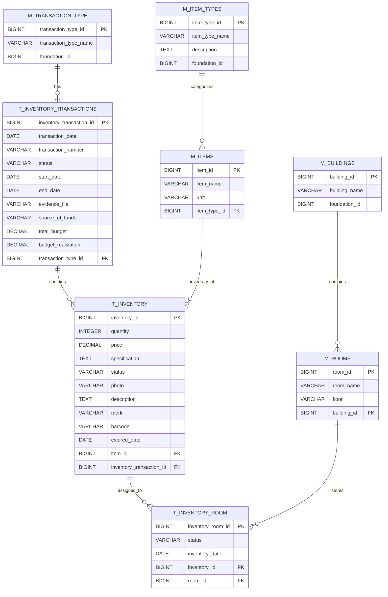

# Studi Kasus: Sistem Informasi Inventory Aset Berbasis Web

## 1. Latar Belakang

Sebuah yayasan pendidikan memiliki banyak aset seperti komputer, meja, kursi, dan perangkat laboratorium yang tersebar di beberapa gedung dan ruangan.

Saat ini pencatatan inventaris masih dilakukan secara manual menggunakan Excel, sehingga sering terjadi:

- Duplikasi data barang
- Kesulitan tracking lokasi barang
- Tidak jelas riwayat transaksi barang
- Sulit memantau kondisi dan status barang
- Kesalahan dalam pelaporan anggaran dan realisasi

Untuk mengatasi permasalahan tersebut, diperlukan **Sistem Informasi Inventory berbasis web** yang terintegrasi.

---

## 2. Tujuan Sistem

- Mengelola data inventaris secara terpusat
- Mencatat transaksi masuk/keluar barang
- Melacak lokasi barang (per ruangan dan gedung)
- Menyediakan laporan stok dan transaksi
- Mendukung pengelolaan anggaran

---

## 3. Deskripsi Entitas (Berdasarkan Tabel)

### A. Master Data

#### `m_item_types`

Kategori barang, misalnya:

- Elektronik
- Furniture
- Laboratorium
- ATK

#### `m_items`

Data master barang.

**Relasi:**

- `m_items` → `m_item_types`

#### `m_buildings`

Data gedung.

#### `m_rooms`

Data ruangan.

**Relasi:**

- `m_rooms` → `m_buildings`

#### `m_transaction_type`

Jenis transaksi, misalnya:

- Pembelian
- Hibah
- Mutasi
- Penghapusan

---

### B. Transaksi

#### `t_inventory`

Data stok barang.

Menyimpan informasi:

- Jumlah (`qty`)
- Harga (`price`)
- Barcode
- Tanggal kedaluwarsa (`expired_date`)
- Relasi ke barang (`m_items`)

#### `t_inventory_transactions`

Header transaksi.

Menyimpan informasi:

- Tanggal transaksi
- Nomor transaksi
- Jenis transaksi
- Anggaran (`budget`)
- Realisasi (`actual`)

#### `t_inventory_room`

Mapping lokasi barang.

**Relasi:**

- Inventory → Room

---

## 4. Alur Bisnis Sistem

### 4.1 Input Master Data

Admin menginput data:

- Jenis barang
- Data barang
- Gedung
- Ruangan
- Jenis transaksi

---

### 4.2 Proses Transaksi Inventory

#### A. Pembelian Barang

Admin membuat transaksi pada tabel `t_inventory_transactions`.

**Jenis transaksi:** Pembelian

Admin menginput:

- Jumlah barang
- Harga barang
- Sumber dana

Sistem akan:

- Menyimpan transaksi
- Menambah data ke `t_inventory`
- Meng-update stok barang

---

#### B. Distribusi Barang ke Ruangan

Admin memilih barang dari `t_inventory`.

Kemudian menentukan ruangan tujuan.

Data distribusi disimpan ke:

- `t_inventory_room`

---

#### C. Mutasi Barang

Barang dipindahkan dari satu ruangan ke ruangan lain.

Sistem melakukan:

- Update data pada `t_inventory_room`

---

#### D. Penghapusan Barang

Barang yang:

- Rusak
- Hilang
- Kedaluwarsa (expired)

akan dihapus dari inventaris.

Sistem melakukan:

- Update status barang pada `t_inventory`
- Mencatat transaksi penghapusan pada `t_inventory_transactions`

---

## 5. Fitur Sistem yang Harus Dibuat (Pemrograman Web 2)

### A. CRUD Master Data

- Item Types
- Items
- Buildings
- Rooms
- Transaction Types

### B. Modul Inventory

- Tambah stok barang
- Update stok barang
- Upload foto barang
- Generate barcode

### C. Modul Transaksi

- Input transaksi
- Detail transaksi
- Upload bukti transaksi (`evidence_file`)

### D. Modul Distribusi Barang

- Assign barang ke ruangan
- Monitoring lokasi barang

### E. Dashboard

Menampilkan:

- Total barang
- Barang per lokasi
- Barang rusak
- Barang expired

### F. Laporan

- Laporan stok barang
- Laporan transaksi
- Laporan anggaran vs realisasi

---

## 6. Contoh Skenario Kasus Nyata

### Kasus

Yayasan membeli **10 unit komputer** untuk laboratorium.

### Langkah-Langkah

#### 1. Input Transaksi

Jenis transaksi:

- Pembelian

Total budget:

- Rp100.000.000

#### 2. Input Barang

Barang:

- Komputer

Jumlah:

- 10 unit

#### 3. Distribusi Barang

- 5 unit ke Lab 1
- 5 unit ke Lab 2

---

## 7. Contoh Use Case Diagram (Deskripsi)

### Aktor

- Admin
- Staff Inventory

### Use Case

- Kelola master data
- Input transaksi
- Kelola stok barang
- Distribusi barang
- Lihat laporan

---

## 8. Teknologi yang Direkomendasikan (Pemrograman Web 2)

### Backend

- Laravel
- CodeIgniter

### Frontend

- Bootstrap
- Vue.js

### Database

- MySQL
- PostgreSQL

### API

- RESTful API
